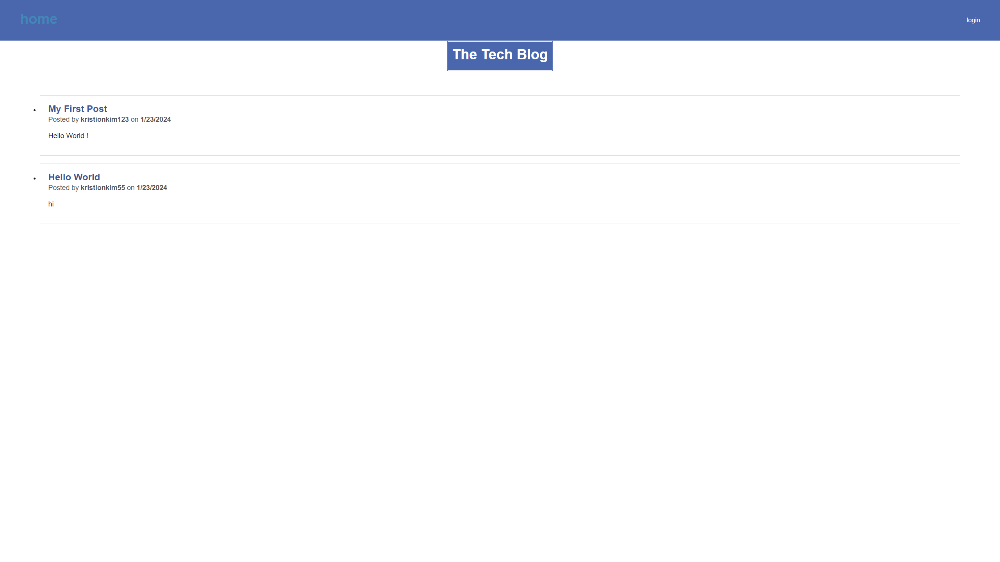

# MVC: Tech Blog
## Introduction
Welcome to my Tech Blog using the Model-View-Controller architectural pattern.

## Description
- My primary motivation in developing this application was to elevate my proficiency in implementing the MVC (Model-View-Controller) architectural pattern. Through this project, I aimed to strengthen my skills in structuring code in a modular and organized manner, with a specific focus on enhancing my understanding of MySQL database integration using Sequelize. 
- This application stands as a testament to the seamless integration of the MVC (Model-View-Controller) architectural pattern, leveraging the power of MySQL database technology, Sequelize for efficient ORM (Object-Relational Mapping), and the robust Express framework.
- With the successful culmination of this website project, I have significantly advanced my proficiency in working with MySQL databases within the MVC architectural pattern. Additionally, this endeavor has fortified my command over Handlebars, a key component in creating dynamic and elegant user interfaces.
- Throughout the development of this project, I proactively enhanced my proficiency in Handlebars by diligently studying its official documentation. This deliberate effort allowed me to deepen my understanding and refine my skills, contributing to an elevated level of expertise in crafting dynamic and expressive user interfaces.

## Installation 
1. Clone the repository: `git clone https://github.com/kimkristion/Tech-Blog.git`
2. Navigate to the project directory
3. Install dependencies: `npm install`
4. Configure environment variables (e.g., database connection, payment gateway credentials)
5. Navigate to the db directory and run mysql shell commands to start database
6. Start the development server: `npm start`

## Usage 

https://radiant-castle-25320-59c5861ae913.herokuapp.com/ 
Heroku Deployment

## License 
No License Provided

